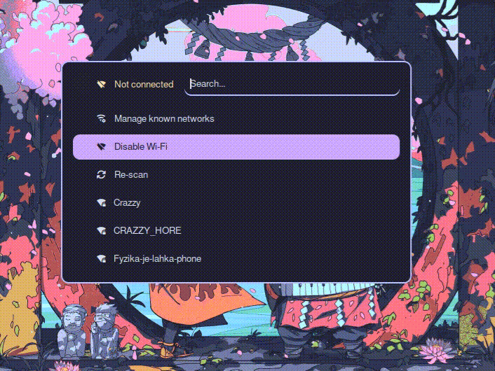

# Bya-applets: Wifimenu

A [rofi](https://github.com/davatorium/rofi) based dynamic menu applet to manage Wi-Fi using [NetworkManager](https://networkmanager.dev/) nmcli.

<p align="center">
  
</p>

Inspired by [rofi-wifi-menu](https://github.com/ericmurphyxyz/rofi-wifi-menu) and the GOAT [Catppuccin](https://github.com/catppuccin/rofi) rofi theme.

## Features

- A daemon to run Wi-Fi scans managable by an external tool (like [Waybar](https://github.com/Alexays/Waybar))
- Main menu to enable/disable Wi-Fi, manually trigger a scan and open a submenu to manage known networks
- Submenu to manage known networks (control autoconnect, forget network)

## Requirements

1. [rofi](https://github.com/davatorium/rofi)
2. [NetworkManager](https://networkmanager.dev/)
3. [Iosevka Nerd Font](https://www.nerdfonts.com/#features) (or any other Nerd Font you prefer)
4. libnotify compatible notification daemon ([dunst](https://github.com/dunst-project/dunst), [mako](https://github.com/emersion/mako),...)
5. [GNU Coreutils and gawk](https://www.gnu.org/software/coreutils/)

## Installation

Clone the repo and copy its contents to wherever u prefer. Ideally add its `scripts` directory to your `PATH` as well.

## Usage

### Wifimenu

Run `wifimenu`.

### Wifidaemon

You can use an external tool (eg. Waybar) to periodically perform a Wi-Fi scan using `wifidaemon`. `wifidaemon` prompts `nmcli` to scan for available Wi-Fi stations and gather information about current Wi-Fi connection. `wifimenu` uses this data to render it in its menu.

You do not have to periodically scan using `wifidaemon` tho. `wifimenu` starts a scan when run if no Wi-Fi scan was performed in the last 30s. This scan timeout can be set by a `wifidaemon_timeout` environment variable

eg.
```
# .bashrc/.zshrc
export wifidaemon_timeout=60#s
```

### Theming

You can find the theming .rasi files in the `config` directory.

```
.
└── config
    ├── colors.rasi         # color scheme
    ├── font.rasi           # font setting
    ├── pwd.rasi            # password prompt theme
    └── wifimenu.rasi       # main menu and submenu theme
```
